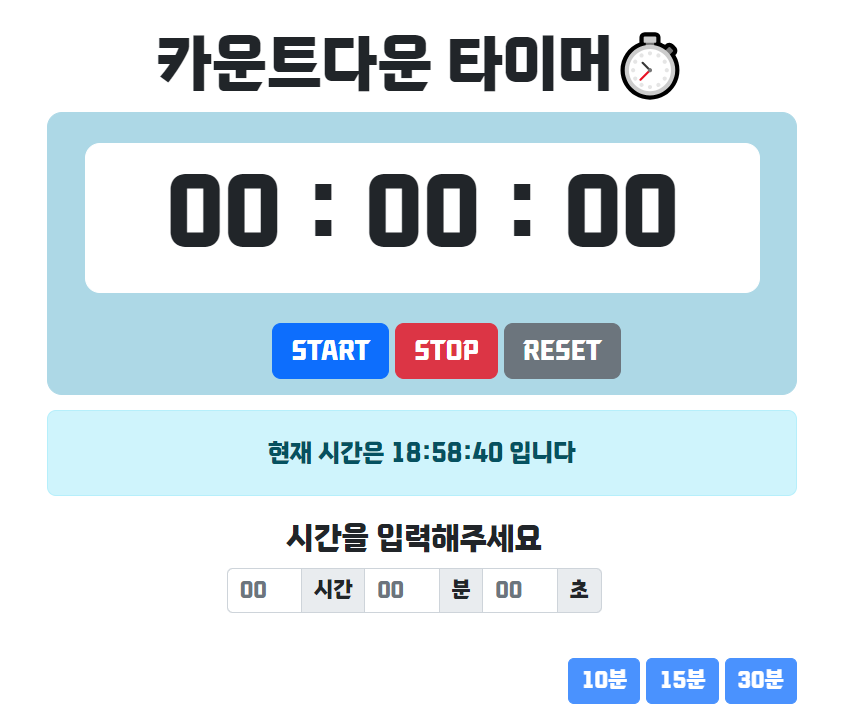

# 미션 - 카운트다운 타이머 만들기
<a href="https://haazzero.github.io/RESAT_FE/day2/timer.html">체험 해보기</a>

## 🔍 요청사항
- [v] 시간, 분, 초를 입력하는 영역이 존재한다.
- [v] START, STOP, RESET 버튼이 존재한다.
- [v] START 버튼을 누르면 시간, 분, 초 단위로 카운트 다운 작동 (시간, 분, 초를 입력하는 영역이 사라진다)
- [v] STOP 버튼을 누르면 카운트 다운을 정지한다.
- [v] RESET 버튼을 누르면 모든 항목 0으로 초기화 되면서 다시 시간,분,초를 입력하는 영역이 나타난다.
    - 초기화 되는 항목은 시간 입력 영역과 표시 부분의 시간이다.
- [v] 타이머가 종료되면 '타이머 종료'로 alert을 띄우고 reset과 같은 상태로 돌아간다

## 추가 요청사항
- [v] 하단에 현재시간을 표시한다.
- [v] 10분, 15분, 30분 원클릭 버튼을 만든다.
- [v] 타이머가 끝나면 alert과 함께 알림음

## issue
- start 버튼을 누르고 난 뒤엔 stop버튼이나 reset버튼을 누르기 전까지는 start버튼이 뜨지 않아야함
- stop 버튼을 누르고 다시 start 버튼을 누르면 초가 그대로 -1초가 되야하는데, +1초가 됐다가 다시 -1초로 동작됨
- [v] input number에 음수값이 들어감
- [v] reset 버튼 클릭시 00만 뜨고 다시 타이머가 돌아감

### TIL
- DIV 요소 수직 및 수평 가운데 정렬
- HTML 요소 보이기/숨기기
- 웹폰트 적용
- 자바스크립트 시간 계산 및 오늘날짜 함수
- 오디오 태그
- 깃헙 웹 호스팅