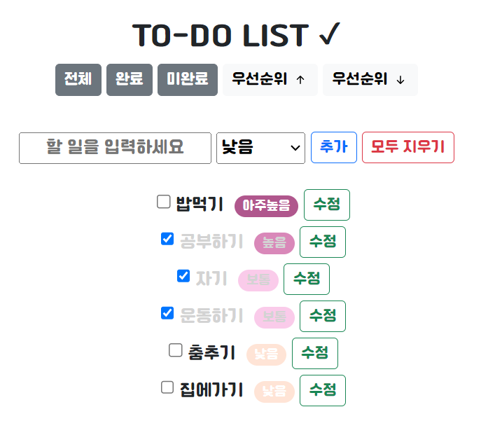

# 미션 - To-Do 리스트 만들기
<a href="https://haazzero.github.io/RESAT_FE/day3/todoList.html">체험 해보기</a>

## 🔍 요청사항
- [v] 할 일을 작성할 수 있는 영역이 존재한다.
- [v] 할 일의 우선순위를 지정할 수 있다(낮음, 보통, 높음, 아주 높음)
- [v] 할 일 추가하기 버튼을 클릭하면 할 일 목록에 작성된 내용이 추가된다.
- [v] 추가된 내용은 수정할 수 있다.
- [v] 할 일 목록은 해결/미해결을 체크박스를 이용해 처리할 수 있다.
    - [v] 체크박스를 체크하면 해당 할 일의 상태가 "완료"로 변경
- [v] 리스트는 전체/해결/미해결로 분리해서 나열할 수 있다.

## 추가 요청사항
- [v] (선택사항) 우선 순위 별 UI 또는 아이콘을 넣어서 강조할 수 있다.
- 체크박스 체크 시 체크한 할일은 가장 하단으로 이동
- [v] 우선순위 높은순/낮은순으로 정렬할 수 있다.
- [v] 모두 지우기 버튼을 클릭하면 모든 할일을 삭제할 수 있다.
- [v] 입력한 할 일을 한 개씩 지울 수 있다.
- [v] 할 일이 입력되지 않고 입력 시 '할 일을 입력하세요' alert
- [v] 추가 버튼과 더불어 엔터 키 입력시에도 적용
- [v] 이미 한 일은 글씨를 회색으로

## issue
- 할 일 수정 시 입력받는 것 말고 바로 텍스트 누르고 수정하고, 다른 빈곳을 누르면 수정되게 하고싶음
- 우선순위도 수정되게 하고싶음
- [v] select 글자 잘림 : 글씨체 교체

### TIL
-  document.createElement로 만든 요소에 class 지정하는 방법, style 지정하는법
-  li 동그라미 숨기는 방법