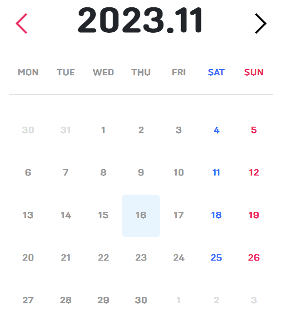

# 미션 - date 객체를 활용한 캘린더 만들기
<a href="https://haazzero.github.io/RESAT_FE/day4/calendar.html">체험 해보기</a>

## 🔍 요청사항
- [v] 달력을 만들고 좌우 화살표를 누르면 해당하는 월로 넘어갑니다.
- [v] 일마다 선택이 가능해야 하며, 해당 일을 선택했을 경우 메모장이 노출됩니다.
- [v] 메모장에는 메모를 입력할 수 있습니다.  
    - 메모장은 모달창으로 구현
- 메모를 입력한 후 다시 캘린더 화면으로 돌아오면 해당 일에 작은 원으로 메모가 있음을 표시합니다.
- 메모 기록이 있는 날짜를 클릭할 경우 기록 했던 메모장이 노출됩니다.
- [v] 메모장에 기록한 내용을 수정할 수 있습니다.

## 추가 요청사항
- 좌우 화살표를 누르면 1년씩 이전 이후로 넘어가게 하기
- today버튼을 누르면 오늘 날짜로 이동한다

## issue
- 모달창에서 일뿐만 아니라 월도 가져와야함
- db없이 값을 CRUD하는 방법을 모르겠다

### TIL
- 제이쿼리는 지양해야하는건가?
- (x) 전역변수 선언하기
- (x) fake api 사용 - json server (메모를 등록, 수정, 조회 해야하기 때문에)
- list-style-image