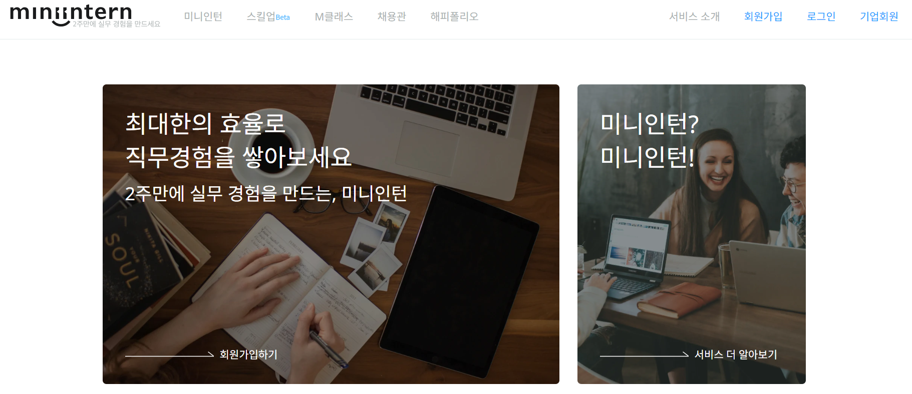

# 미션 - 미니인턴 서비스 메인페이지 클론
<a href="https://haazzero.github.io/RESAT_FE/day5/miniintern.html">체험 해보기</a>

## 🔍 요청사항
- 미니인턴 서비스 메인 페이지
    -  HTML, CSS를 활용하여 메인 페이지 클론 코딩
    - 슬라이드는 구현하지 않음, 슬라이드 영역은 이미지로 대체

## 추가 요청사항
- (선택사항) 마우스 호버 시 애니메이션 등 기능 구현

## issue
- 일정 문제로 일단 부트스트랩 템플릿으로 구현
- 11월 18일 예비
- 11월 21일 보완

### TIL
- 개발자 도구 활용법
    - 개발자 도구를 활용하여 미니인턴 홈페이지 구조를 본다
- CSS 파일을 HTML 파일과 연결하기
- Template URL: https://bootstrapmade.com/bizland-bootstrap-business-template/
- 이미지 위에 텍스트