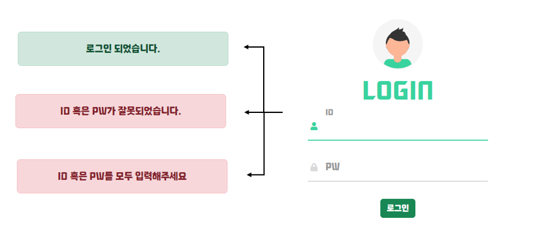

# 미션 - 로그인 페이지 만들기
<a href="https://haazzero.github.io/RESAT_FE/day10/login.html">체험 해보기</a>

## 🔍 요청사항
- [v] ID,PW 값을 임의로 지정합니다.
    - [v] admin, 1111
- [v] ID,PW 입력창 및 로그인 버튼이 존재합니다.
- [v] 로그인 버튼 눌렀을 경우, ID/PW 둘 중 하나라도 오기재가 되면 팝업 또는 토스트 알림 (ID 혹은 PW가 잘못되었습니다)이 나옵니다. 
    - [v] 토스트 알림이 아닌 유효성이 맞지 않는 것에 해당하는 Input 창 아래에 이유를 표기해주는 방법도 있습니다.
- [v] 로그인 버튼을 눌렀을 경우, ID/PW가 정확히 일치하면 팝업 토스트 알림 (로그인이 되었습니다)이 나옵니다.

## 추가 요청사항
- 아무것도 입력하지 않을 시?

## issue

### TIL
- Toasts 알림이란? 예쁜 alert 느낌 +  몇 초 동안만 표시되는 경고 상자
