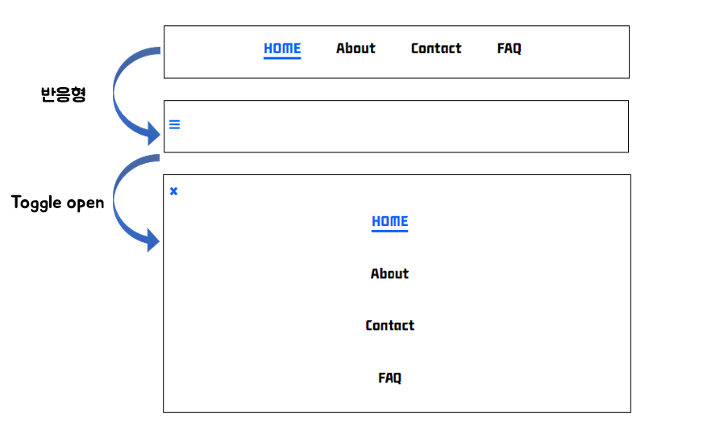

# 미션 - 반응형 네비게이션 & 메뉴바 만들기
<a href="https://haazzero.github.io/RESAT_FE/day9/nav.html">체험 해보기</a>

## 🔍 요청사항
- [v] Home, About, Contact, FAQ 네 가지의 메뉴가 존재합니다.
- [v] 화면 크기가 일정 비율 이상 줄어들면 각 메뉴는 햄버거 메뉴로 통합됩니다.
- [v] 햄버거 메뉴 안에 사이드 바로 Home, About, Contact, FAQ 네 가지 메뉴가 존재합니다.

## 추가 요청사항
- [v] active 구현
    - [v] 텍스트 색상 변경
    - [v] 밑줄
- [v] hover 구현
    - [v] 텍스트 색상 변경
    - [v] 밑줄
- 햄버거 메뉴의 토글이 열릴시 햄버거 메뉴 아이콘이 'X'로 변경
    - 변경 될 때 햄버거로 돌아오면 45도 회전
- 햄버거 메뉴의 토글이 열릴시 트랜지션 효과

### TIL
- 반응형이란? 
    - 하나의 웹사이트에서 PC, 스마트폰, 태블릿 PC 등 접속하는 디스플레이의 종류에 따라   
    화면의 크기가 자동으로 변하도록 만든 웹페이지 접근 기법
- 햄버거 메뉴란?
    - 모바일 웹사이트 또는 앱에서 네비게이션 메뉴를 숨기고 아이콘 형태의 버튼으로 표시하는 디자인 패턴
- 구글 개발자도구 요소 - 레이아웃에서 반응형을 확인할 수 있음
- 반응형 웹 디바이스별 해상도, 반응형 분기점 리스트
- 'viewport'의 의미
- CSS 변수의 이해
- 미디어 쿼리
- text-underline-offset
- toggle